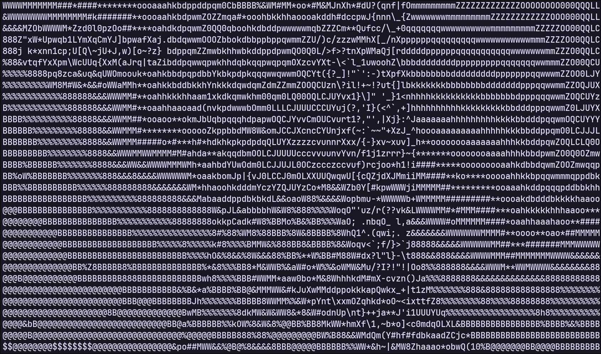
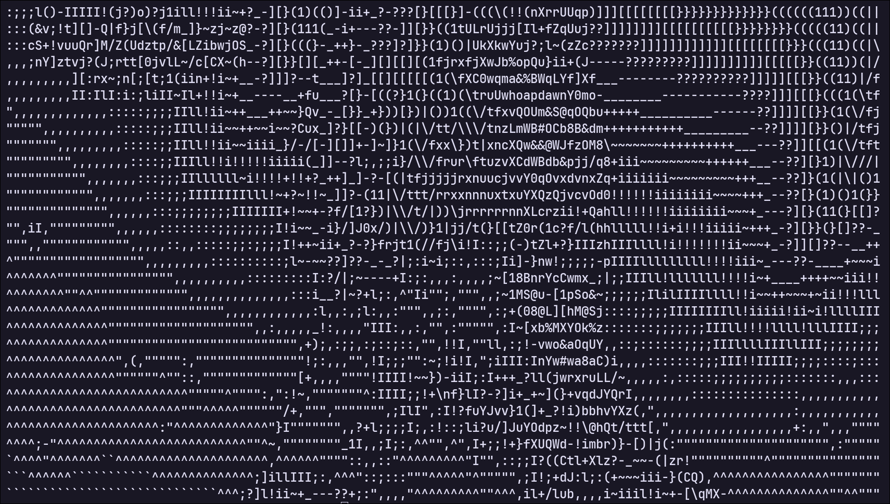

# Image_to_ascii
Simple C program that converts images into ASCII on the terminal

## Requirements
**To Build**
- C Compiler
## How to use
1. Clone the repo OR download the release executable
2. Run using `./image_to_ascii -f <filepath>`

**Available Parameters**
- `-f` filepath of the image to convert. If not given program will ask for path
- `-w` width of the text. Defaults to 80
- `-t` type of brightness. Examples can be seen below
- `-k` amount of clusters for color clustering. Defaults to 5. The lower the faster
- `-c` whether the ASCII text will be colored or not. 0 is colored, 1 is non colored. Defaults to 0

### Original Image

### Colored Type 1

### Colored Type 2

### Colored Type 3

### Monochrome Type 1

### Monochrome Type 2

### Monochrome Type 3

